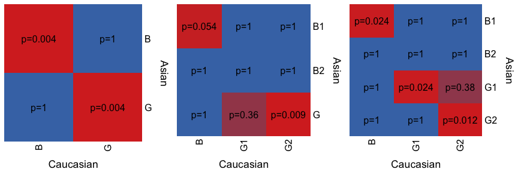
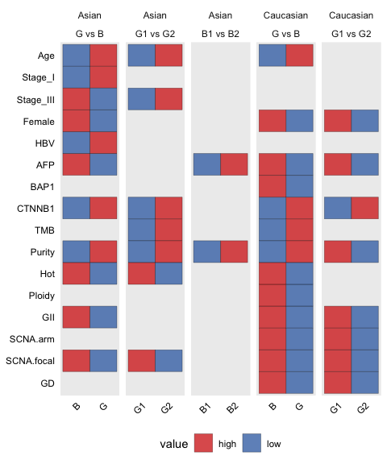
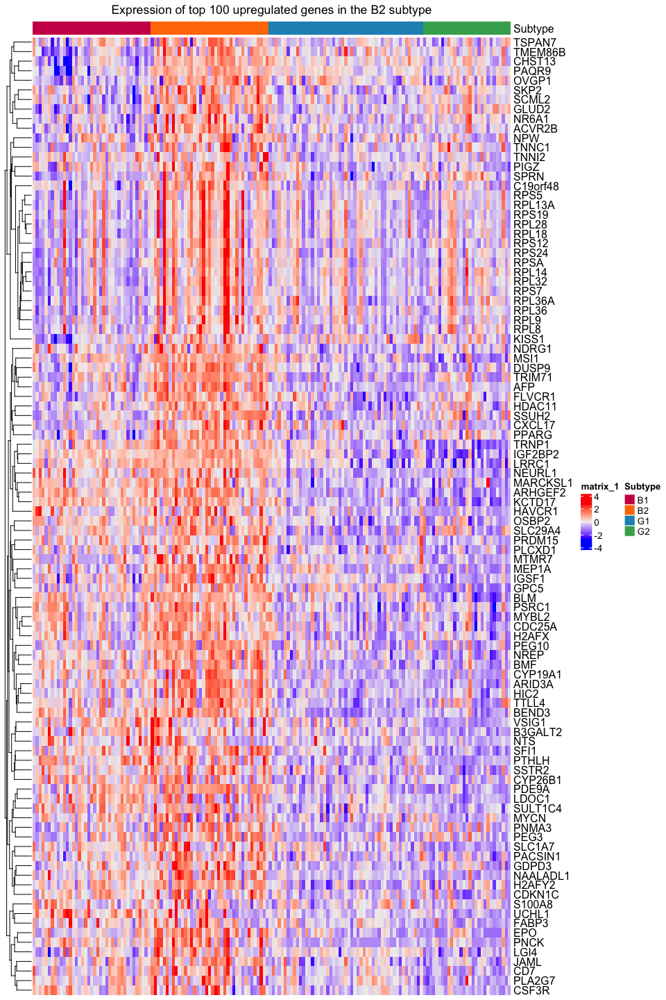

Identifying HCC subtypes and the B2 subtype
================
Arife Neslihan Kaya
16/02/2023

``` r
##load libraries
pacman::p_load(tidyverse,data.table,ComplexHeatmap,knitr,GSVA,
               fgsea,png,grid,dendextend,gridExtra,EnvStats,patchwork,
               kableExtra,unikn,patchwork,sjPlot,sjmisc,fastDummies,lsa)
setDTthreads(6)
##source the masterfile which contains several clinical and molecular features
Data <- fread("data/Masterfile_TCGA.tsv") %>% as.data.frame() %>% 
  mutate_if(grepl("mut",.)==TRUE,function(x) factor(x,c("wt","mut"))) ##color palettes
asian_col <- usecol("pal_unikn_light")[c(5)]
caucasian_col <- usecol("pal_unikn_light")[c(7)]
subtypes_col_pal <- c("B"="#d73027","G"="#2166ac","B1"="#ce1256",
                      "B2"="#ff7a00","G1"="#1d91c0","G2"="#41ab5d")

#as.character(Reduce(paste, deparse(formula(fit1))))

layout_mat = rbind(c(1,1,2,2,3,3),
                   c(1,1,2,2,3,3))

# source Functions file 
source("Functions.R")
```

### NMF output: Num of cluster selection

NMF was run in R package “NMF” using the Brunet algorithm. Top 3000 most
variable genes were used to run NMF. Algorithm number of runs is 200.
Below we will analyze transcriptomic subtypes in Asian and European
patients in the TCGA cohort.

``` r
# load NMF results
Asian_NMF <- "data/asianTCGA_158_Asian_deseq2_top_3000.txt_200_nmfncbrunet_nc.rds"
Caucasian_NMF <- "data/caucasianTCGA_184_Caucasian_deseq2_top_3000.txt_200_nmfncbrunet_nc.rds"

# load top3000 most variables genes
Asian_top3000 <- fread("data/TCGA_158_Asian_deseq2_top_3000.txt") %>%  
  tibble::column_to_rownames("V1")
Caucasian_top3000 <- fread("data/TCGA_184_Caucasian_deseq2_top_3000.txt") %>% 
  tibble::column_to_rownames("V1")

# load all normalized genes 
Asian_all_genes <-fread("data/TCGA_158_Asian_deseq2.tsv") %>%   
  tibble::column_to_rownames("V1") 
Caucasian_all_genes <-fread("data/TCGA_184_Caucasian_deseq2.tsv") %>%   
  tibble::column_to_rownames("V1") 


print(paste0("The best fit for Asian is: ", 
             selectBestFitNMF(Asian_NMF,byw = "cophenetic")))
```

    ## [1] "The best fit for Asian is: 4"

``` r
print(paste0("The best fit for European is: ", 
             selectBestFitNMF(Caucasian_NMF,byw = "cophenetic")))
```

    ## [1] "The best fit for European is: 3"

We run NMF Brunet algorithm for different ranks from 2 to 6 and 200 runs
for each. Let’s look at cophenetic correlation and silhouette values
across ranks to choose optimal number of clusters.

``` r
cop_sil_asian <- plotRanksNMF(Asian_NMF,"Asian")
cop_sil_caucasian <- plotRanksNMF(Caucasian_NMF,"Caucasian")
cop_sil_asian/cop_sil_caucasian
```

<!-- -->

For Asians, 4 is the optimal number of cluster. For Caucasians 3 is the
optimal number. Now let’s plot consensus matrices.

``` r
grid.draw(arrangeGrob(grid.grabExpr(consensusmap(getfitNMF(Asian_NMF,2),tracks = c(),
                                                 main = "Asian rank = 2")),
                      grid.grabExpr(consensusmap(getfitNMF(Asian_NMF,3),tracks = c(),
                                                 main = "Asian rank = 3")),
                      grid.grabExpr(consensusmap(getfitNMF(Asian_NMF,4),tracks = c(),
                                                 main = "Asian rank = 4")),
                      layout_matrix = layout_mat))
```

<!-- -->

For Asians, 4 looks quite delineated.

``` r
grid.draw(arrangeGrob(grid.grabExpr(consensusmap(getfitNMF(Caucasian_NMF,2),tracks = c(),
                                                 main = "Caucasian rank = 2")),
                      grid.grabExpr(consensusmap(getfitNMF(Caucasian_NMF,3),tracks = c(),
                                                 main = "Caucasian rank = 3")),
                      grid.grabExpr(consensusmap(getfitNMF(Caucasian_NMF,4),tracks = c(),
                                                 main = "Caucasian rank = 4")),
                      layout_matrix = layout_mat))
```

<!-- -->

For Caucasian, 3 is better than 4.

``` r
## swap function for swapping subtype names
swap <- function(vec, from, to) {
  tmp <- to[ match(vec, from) ]
  tmp[is.na(tmp)] <- vec[is.na(tmp)]
  return(tmp)
}

#renaming was done after mapping to literature pathways.
asian2 <- getSubtypesNMF(Asian_NMF,2) %>% 
  mutate(subtype=swap(swap(subtype,1,"B"),2,"G"))
asian3 <- getSubtypesNMF(Asian_NMF,3) %>% 
  mutate(subtype=swap(swap(swap(subtype,3,"B1"),2,"B2"),1,"G"))
asian4 <- getSubtypesNMF(Asian_NMF,4) %>%
  mutate(subtype=swap(swap(swap(swap(subtype,2,"B1"),1,"B2"),3,"G1"),4,"G2"))
caucasian2 <- getSubtypesNMF(Caucasian_NMF,2) %>% 
  mutate(subtype=swap(swap(subtype,2,"B"),1,"G"))
caucasian3 <- getSubtypesNMF(Caucasian_NMF,3) %>% 
  mutate(subtype=swap(swap(swap(subtype,2,"B"),3,"G2"),1,"G1"))
```

I have selected 2, 3 or 4 clusters for each cohort. Let’s analyze
survival differences of these subtypes. Note: We have changed B2 subtype
naming to P2 later on. In this documents these two (P2/B2) could have
been used to define Asian enriched subtype.

``` r
Data.survival <- fread("data/Masterfile_TCGA_survival.tsv")

asian_subtypes <- asian2 %>% rename(S2="subtype") %>% 
  inner_join(.,asian3 %>% rename(S3="subtype")) %>% 
  inner_join(.,asian4 %>% rename(S4="subtype")) %>% 
  mutate(sample=substr(sample,1,12)) %>% 
  left_join(.,Data.survival)

surv2 <- survPlot(asian_subtypes, Time =  "OS.time",Event = "OS",var = "S2",risktable = T, 
          palette = c(subtypes_col_pal[["B"]],subtypes_col_pal[["G"]]))

surv3 <- survPlot(asian_subtypes, Time =  "OS.time",Event = "OS",var = "S3",risktable = T, 
          palette = c(subtypes_col_pal[["B1"]],subtypes_col_pal[["B2"]],
                      subtypes_col_pal[["G"]]))
  
surv4 <- survPlot(asian_subtypes, Time =  "OS.time",Event = "OS",var = "S4",risktable = T, 
          palette = c(subtypes_col_pal[["B1"]],subtypes_col_pal[["B2"]],
                      subtypes_col_pal[["G1"]],subtypes_col_pal[["G2"]]))

survs_asian <- (surv2$plot+surv2$table+plot_layout(ncol = 1,heights = c(5,1)))|
  (surv3$plot+surv3$table+plot_layout(ncol = 1,heights = c(5,1)))|
  (surv4$plot+surv4$table+plot_layout(ncol = 1,heights = c(5,1)))
survs_asian
```

<!-- -->

``` r
caucasian_subtypes <- caucasian2 %>% rename(S2="subtype") %>% 
  inner_join(.,caucasian3 %>% rename(S3="subtype")) %>% 
  mutate(sample=substr(sample,1,12)) %>% 
  left_join(.,Data.survival)

surv2cau <- survPlot(caucasian_subtypes, Time =  "OS.time",Event = "OS",var = "S2",
                     risktable = T, 
          palette = c(subtypes_col_pal[["B"]],subtypes_col_pal[["G"]]))

surv3cau <- survPlot(caucasian_subtypes, Time =  "OS.time",Event = "OS",var = "S3",
                     risktable = T, 
          palette = c(subtypes_col_pal[["B"]],subtypes_col_pal[["G1"]],
                      subtypes_col_pal[["G2"]]))
  
survs_caucasian <- (surv2cau$plot+surv2cau$table+plot_layout(ncol = 1,
                                                             heights = c(5,1)))|
  (surv3cau$plot+surv3cau$table+plot_layout(ncol = 1,heights = c(5,1)))
survs_caucasian
```

<!-- -->

## Activity score calculation

Using gene signatures from previous HCC subtyping papers, I have
calculated a pathway activity score. Patients were assigned to the
subtype with highest pathway activity score for some subtypes (Hoshida,
Boyault, Chiang, Lee survival) and raw activity scores were used for
gene set (lee hepatoblast, Roessler Metastasis).

Steps (method from Robinson et al. )

-   Collect gene sets from MSigDB.
-   Convert gene expression of all genes in a gene set to percentiles
    across patients.
-   Take the mean percentile transformed value across genes for each
    patient.
-   Assign patients to max pathway activity for subtypes (Hoshida, Lee,
    Chiang, Boyault) , or keep pathway activity score (Roessler
    metastasis and Lee Hepatoblast subtype (HB))

``` r
Asian_literature_Pathway <- calc_pathway_activity_subtypes(Asian_all_genes,asian4,
                                                           col=c(subtypes_col_pal["B1"],
                                                                 subtypes_col_pal["B2"],
                                                                 subtypes_col_pal["G1"],
                                                                 subtypes_col_pal["G2"]))
```

<!-- -->

``` r
Caucasian_literature_Pathway <- calc_pathway_activity_subtypes(Caucasian_all_genes,caucasian3,
                                                               col=c(subtypes_col_pal["B"],
                                                                     subtypes_col_pal["G1"],
                                                                     subtypes_col_pal["G2"]))
```

<!-- -->

## PCA Analysis

``` r
Asian_pca <- pca(Asian_top3000,asian2$subtype,title = "Asian 2 subtypes", 
                 colpal = c(subtypes_col_pal["B"],subtypes_col_pal["G"]))+
  pca(Asian_top3000,asian3$subtype,title = "Asian 3 subtypes",
      colpal=c(subtypes_col_pal["B1"],
               subtypes_col_pal["B2"],
               subtypes_col_pal["G"]))+
  theme(legend.position ="none")+
  pca(Asian_top3000,asian4$subtype,title = "Asian 4 subtypes",
      colpal=c(subtypes_col_pal["B1"],
               subtypes_col_pal["B2"],
               subtypes_col_pal["G1"],
               subtypes_col_pal["G2"]))

Asian_pca
```

<!-- -->

``` r
Caucasian_pca <- pca(Caucasian_top3000,caucasian2$subtype,
                     title = "Caucasian 2 subtypes",
                     colpal = c(subtypes_col_pal["B"],
                                subtypes_col_pal["G"]))+
  pca(Caucasian_top3000,caucasian3$subtype,
      title = "Caucasian 3 subtypes",
      colpal = c(subtypes_col_pal["B"],
                 subtypes_col_pal["G1"],
                 subtypes_col_pal["G2"]))

Caucasian_pca
```

<!-- -->

## Mapping subtypes: SubMap

``` r
submap.results <-  lapply(list.files("data/submap/","Bonferroni_SAmatrix.gct$",
                    full.names=T,recursive=T),function(x){
                      as.matrix(read.delim(x,row.names = 1,skip = 2)[,-1])
                    })

names(submap.results)= list.files("data/submap/","Bonferroni_SAmatrix.gct$",
                    full.names=T,recursive=T) %>% 
  basename(.) %>% gsub("_Bonferroni_SAmatrix.gct","",.)

colnames(submap.results[[1]])=sort(c(unique(caucasian2$subtype)))
rownames(submap.results[[1]])=sort(c(unique(asian2$subtype)))
two_st <- plot_submap(submap.results[[1]],col.title = "Caucasian",row.title = "Asian")

colnames(submap.results[[2]])=sort(c(unique(caucasian3$subtype)))
rownames(submap.results[[2]])=sort(c(unique(asian4$subtype)))
four_st <- plot_submap(submap.results[[2]],col.title = "Caucasian",row.title = "Asian")


colnames(submap.results[[3]])=sort(c(unique(caucasian3$subtype)))
rownames(submap.results[[3]])=sort(c(unique(asian3$subtype)))
three_st <- plot_submap(submap.results[[3]],col.title = "Caucasian",row.title = "Asian")
```

<!-- -->

Now I will compare clinical and molecular features between Good (G) and
Bad (B) subypes in Asian and Caucasian separately. I will also compare
G1 and G2 in both cohorts. I can only compare B1 vs B2 in Asian.

## Comparison of features between subtypes

``` r
#Feature list####
Clinical_features <- c("age","gender","race","stage","AFP","vas_invasion","HBV","HCV")
Molecular_features <- c("GII","ploidy","SCNA.focal","SCNA.arm","GD","TMB","immuneGr","purity")
Selected_drivers <- fread("data/TCGA_driver_binary.tsv") %>% select(-sample) %>% 
  select_if(colSums(.)>10) %>% colnames()
Frequent_CNV_events_arm <- c("AMP_1q","AMP_5p","AMP_6p",
                             "AMP_8q","DEL_13q","DEL_16q",
                             "DEL_17p","DEL_21p", "DEL_4q","DEL_8p")
Frequent_CNV_events_focal <- c("AMP_16q11.2","AMP_1q21.1",
                               "AMP_2p11.1","DEL_1p36.13",
                               "DEL_1p36.31","DEL_16q11.2")  
Clonality_features <- c("MATH","Clone_no","Simpson","Shannon",
                        "pLM","neutrality","RNA_ITH")
Other_molecular_feature <- c("GII_amp","GII_del","SCNA.focal.amp",
                             "SCNA.focal.del","SCNA.arm.amp","SCNA.arm.del", 
                             "SCNA.focal.now","SCNA.arm.now","SigGr")
Feat_list_for_RNA <- c(Clinical_features,Molecular_features,Selected_drivers)

##function to format Data for comparison of molecular and
##clinical feature between subtypes
manipulate_for_feat_comparison <- function(subtype_df,racem){
return(Data %>% left_join(subtype_df %>% mutate(sample=substr(sample,1,12))) %>% 
  select(c(Feat_list_for_RNA,subtype)) %>% filter(race==racem) %>%  select(-race) %>% 
    rename(Purity="purity",Stage="stage",Age="age",Ploidy="ploidy") %>% 
  mutate(Female=ifelse(gender=="FEMALE","1","0")) %>% 
fastDummies::dummy_cols(c("Stage"),remove_selected_columns = T,
                        remove_first_dummy = F,ignore_na = T) %>% 
  mutate_at(.,vars(matches("stage_")),as.character) %>% 
  mutate_at(.,vars(matches("AMP_|DEL_")), function(x) ifelse(x%in%c("AMP","DEL"),"1","0")) %>% 
  mutate_at(.,vars(matches(Selected_drivers)),function(x) ifelse(x=="mut","1","0")) %>% 
  mutate(GD=ifelse(GD=="GD","1","0"), #remove immune gr gender 
         Hot=ifelse(immuneGr=="hot","1","0"),
         HBV=ifelse(HBV=="HBV+","1","0"),
         HCV=ifelse(HCV=="HCV+","1","0"),
         MVI=ifelse(vas_invasion=="Yes","1","0")) %>% 
  select(-c(gender,immuneGr,vas_invasion)))
}


asian_difference2 <- manipulate_for_feat_comparison(asian2,"ASIAN")
caucasian_difference2 <- manipulate_for_feat_comparison(caucasian2,"CAUCASIAN")

cl <- c(Clinical_features,"Stage_I","Stage_II",
        "Stage_III","Stage_IV","Age","Female","MVI")
ml <- c(Molecular_features,"Ploidy","Purity","Hot")

## differences between Good and Bad subtypes.
asian_p_values <- sapply(colnames(asian_difference2)[!colnames(asian_difference2)%in%
                                                       c("subtype")],
                         function(x) calculate_p_value(asian_difference2,"subtype",x)) %>% 
  as.data.frame() %>% tibble::rownames_to_column("feature") %>% rename(asian_p_value=2) %>% 
  mutate(categ=ifelse(feature%in%cl,"Clinical",
                      ifelse(feature%in%ml,"Molecular",
                             ifelse(feature%in%Selected_drivers,"Driver",feature)))) %>% 
  group_by(categ) %>%   mutate(asian_p.adj=p.adjust(asian_p_value,"BH")) %>% 
  as.data.frame() %>%  select(-categ)


caucasian_p_values <- sapply(colnames(caucasian_difference2)[!colnames(caucasian_difference2)%in%
                                                               c("subtype")],
                             function(x) calculate_p_value(caucasian_difference2,"subtype",x)) %>% 
  as.data.frame() %>% tibble::rownames_to_column("feature") %>% 
  rename(caucasian_p_value=2) %>% 
  mutate(categ=ifelse(feature%in%cl,"Clinical",
                      ifelse(feature%in%ml,"Molecular",
                             ifelse(feature%in%Selected_drivers,"Driver",feature)))) %>% 
  group_by(categ) %>%  
  mutate(caucasian_p.adj=p.adjust(caucasian_p_value,"BH"))%>% as.data.frame() %>%  
  select(-categ)

## annotate the subtype with higher value for each feature 
asian_directions_num <- (asian_difference2 %>% group_by(subtype) %>% 
                           summarise_if(is_numeric,function(x) mean(x,na.rm=T)))[1:2,] %>% 
  apply(.,2,function(x) which.max(x)) %>% unlist() %>% as.data.frame() %>% 
  tibble::rownames_to_column("feature") %>% rename(Asian=2) %>% 
  mutate(Asian=ifelse(Asian==2,"G","B"))

asian_directions_char <- (asian_difference2 %>% group_by(subtype) %>% 
                            summarise_if(is.character,
                                         function(x) 
                                           sum(x=="1",na.rm = T)))[1:2,] %>% 
  apply(.,2,function(x) which.max(x)) %>% unlist() %>% as.data.frame() %>% 
  tibble::rownames_to_column("feature") %>% rename(Asian=2)%>% 
  mutate(Asian=ifelse(Asian==2,"G","B"))


caucasian_directions_num <- (caucasian_difference2 %>% group_by(subtype) %>% 
                               summarise_if(is_numeric,function(x) 
                                 mean(x,na.rm=T)))[1:2,] %>% 
  apply(.,2,function(x) which.max(x)) %>% unlist() %>% as.data.frame() %>% 
  tibble::rownames_to_column("feature") %>% rename(Caucasian=2) %>% 
  mutate(Caucasian=ifelse(Caucasian==2,"G","B"))

caucasian_directions_char <- (caucasian_difference2 %>% group_by(subtype) %>% 
                                summarise_if(is.character,function(x) 
                                  sum(x=="1",na.rm = T)))[1:2,] %>% 
  apply(.,2,function(x) which.max(x)) %>% unlist() %>% as.data.frame() %>% 
  tibble::rownames_to_column("feature") %>% rename(Caucasian=2)%>% 
  mutate(Caucasian=ifelse(Caucasian==2,"G","B"))


asian_directions <- rbind(asian_directions_num,asian_directions_char)
caucasian_directions <- rbind(caucasian_directions_num,caucasian_directions_char)

assoc_resultGvsB <- inner_join(asian_p_values,caucasian_p_values) %>% 
  mutate(asian_p.adj=ifelse(asian_p.adj < 0.1,"sig",NA)) %>%   
  mutate(caucasian_p.adj=ifelse(caucasian_p.adj < 0.1,"sig",NA)) %>%
  select(1,3,5) %>% 
  inner_join(.,asian_directions) %>% 
  inner_join(.,caucasian_directions) %>% 
  mutate(Asian=ifelse(asian_p.adj=="sig",Asian,NA)) %>% 
  mutate(Caucasian=ifelse(caucasian_p.adj=="sig",Caucasian,NA)) %>%
  filter(asian_p.adj=="sig"|caucasian_p.adj=="sig") %>% 
  select(-c(asian_p.adj,caucasian_p.adj)) %>% 
  melt(.,id.vars=c("feature")) 
```

``` r
asian_difference4 <- manipulate_for_feat_comparison(asian4,"ASIAN") %>% 
  filter(subtype%in%c("G1","G2"))
caucasian_difference3 <- manipulate_for_feat_comparison(caucasian3,"CAUCASIAN") %>% 
  filter(subtype%in%c("G1","G2"))

## differences between Good and Bad subtypes.
asian_p_values_2 <- sapply(colnames(asian_difference4)[!colnames(asian_difference4)%in%
                                                         c("subtype")],
                           function(x) calculate_p_value(asian_difference4,"subtype",x)) %>% 
  as.data.frame() %>% tibble::rownames_to_column("feature") %>% rename(asian_p_value=2) %>% 
  mutate(categ=ifelse(feature%in%cl,"Clinical",
                      ifelse(feature%in%ml,"Molecular",
                             ifelse(feature%in%Selected_drivers,"Driver",feature)))) %>% 
  group_by(categ) %>%  
  mutate(asian_p.adj=p.adjust(asian_p_value,"BH")) %>% as.data.frame() %>%  select(-categ)

caucasian_p_values_2 <- sapply(colnames(caucasian_difference3)[!colnames(caucasian_difference3)%in%
                                                                 c("subtype")],
                               function(x) 
                                 calculate_p_value(caucasian_difference3,"subtype",x)) %>% 
  as.data.frame() %>% tibble::rownames_to_column("feature") %>%
  rename(caucasian_p_value=2) %>% 
  mutate(categ=ifelse(feature%in%cl,"Clinical",
                      ifelse(feature%in%ml,"Molecular",
                             ifelse(feature%in%Selected_drivers,"Driver",feature)))) %>% 
  group_by(categ) %>%  
  mutate(caucasian_p.adj=p.adjust(caucasian_p_value,"BH"))%>% 
  as.data.frame() %>%  select(-categ)

## annotate the subtype with higher value for each feature 
asian_directions_num2 <- (asian_difference4 %>% group_by(subtype) %>% 
                            summarise_if(is_numeric,function(x)
                              mean(x,na.rm=T)))[1:2,] %>% 
  apply(.,2,function(x) which.max(x)) %>% unlist() %>% as.data.frame() %>% 
  tibble::rownames_to_column("feature") %>% rename(Asian=2) %>% 
  mutate(Asian=ifelse(Asian==2,"G2","G1"))

asian_directions_char2 <- (asian_difference4 %>% group_by(subtype) %>% 
                             summarise_if(is.character,function(x) 
                               sum(x=="1",na.rm = T)))[1:2,] %>% 
  apply(.,2,function(x) which.max(x)) %>% unlist() %>% as.data.frame() %>% 
  tibble::rownames_to_column("feature") %>% rename(Asian=2)%>% 
  mutate(Asian=ifelse(Asian==2,"G2","G1"))


caucasian_directions_num2 <- (caucasian_difference3 %>% group_by(subtype) %>% 
                                summarise_if(is_numeric,function(x) 
                                  mean(x,na.rm=T)))[1:2,] %>% 
  apply(.,2,function(x) which.max(x)) %>% unlist() %>% as.data.frame() %>% 
  tibble::rownames_to_column("feature") %>% rename(Caucasian=2) %>% 
  mutate(Caucasian=ifelse(Caucasian==2,"G2","G1"))

caucasian_directions_char2 <- (caucasian_difference3 %>% group_by(subtype) %>% 
                                 summarise_if(is.character,function(x) 
                                   sum(x=="1",na.rm = T)))[1:2,] %>% 
  apply(.,2,function(x) which.max(x)) %>% unlist() %>% as.data.frame() %>% 
  tibble::rownames_to_column("feature") %>% rename(Caucasian=2)%>% 
  mutate(Caucasian=ifelse(Caucasian==2,"G2","G1"))


asian_directions2 <- rbind(asian_directions_num2,asian_directions_char2)
caucasian_directions2 <- rbind(caucasian_directions_num2,caucasian_directions_char2)

assoc_resultG1vsG2 <- inner_join(asian_p_values_2,caucasian_p_values_2) %>% 
  mutate(asian_p.adj=ifelse(asian_p.adj < 0.1,"sig",NA)) %>%   
  mutate(caucasian_p.adj=ifelse(caucasian_p.adj < 0.1,"sig",NA)) %>% select(1,3,5) %>% 
  inner_join(.,asian_directions2) %>% 
  inner_join(.,caucasian_directions2) %>% 
  mutate(Asian=ifelse(asian_p.adj=="sig",Asian,NA)) %>% 
  mutate(Caucasian=ifelse(caucasian_p.adj=="sig",Caucasian,NA)) %>%
  filter(asian_p.adj=="sig"|caucasian_p.adj=="sig") %>% 
  select(-c(asian_p.adj,caucasian_p.adj)) %>% 
  melt(.,id.vars=c("feature"))
```

``` r
merged_assoc <- rbind(assoc_resultG1vsG2 %>% mutate(Comparison="G1 vs G2"),
                      assoc_resultGvsB %>% mutate(Comparison="G vs B")) %>% 
  rbind(.,assoc_resultB1vsB2 %>% mutate(Comparison="B1 vs B2")) %>% na.omit()

orders <- c("Age","Stage_I","Stage_III","Female","HBV","AFP","AXIN1",
           "BAP1", "CTNNB1","TMB","Purity","Hot","Ploidy","GII","SCNA.arm","SCNA.focal","GD")

merged_assoc <- merged_assoc %>% 
  mutate(feature=factor(feature,levels = rev(orders))) %>% 
  mutate(Comparison=factor(Comparison,c("G vs B","G1 vs G2","B1 vs B2")))
```

When we look at B1 vs B2 in Asian, B2 has higher AFP and purity as well
as higher freqeuncyof AXIN1 mutations. Also B2 is colder. WNT activation
because of higher fraction of AXIN1 mutations might be cause of
coldness.

``` r
g1vsg2 <- merged_assoc %>% filter(Comparison=="G1 vs G2") %>% 
  rename(G1="value") %>% mutate(G1=ifelse(G1=="G1","high","low")) %>% 
    mutate(G2=ifelse(G1=="low","high","low")) %>% rename(cohort="variable") %>% 
  melt(.,id.vars=c("feature","Comparison","cohort"))

gvsb <- merged_assoc %>% filter(Comparison=="G vs B") %>%
  rename(G="value") %>% mutate(G=ifelse(G=="G","high","low")) %>% 
    mutate(B=ifelse(G=="low","high","low"))%>% rename(cohort="variable") %>% 
  melt(.,id.vars=c("feature","Comparison","cohort"))

b1vsb2 <- merged_assoc %>% filter(Comparison=="B1 vs B2") %>% 
  rename(B1="value") %>% mutate(B1=ifelse(B1=="B1","high","low")) %>% 
    mutate(B2=ifelse(B1=="low","high","low"))%>% rename(cohort="variable") %>% 
  melt(.,id.vars=c("feature","Comparison","cohort"))

merged_assoc_2 <- rbind(g1vsg2,gvsb,b1vsb2) %>% 
  mutate(Comparison=factor(Comparison,c("G vs B","G1 vs G2","B1 vs B2")),
         variable=factor(variable,c("B","G","B1","B2","G1","G2")))
    
compare_feat_2 <- ggplot(merged_assoc_2,aes(variable,feature,fill=value))+
  geom_tile(alpha=0.8,colour="black")+
  scale_fill_manual(na.value="gray",values = c("#d73027","#4575b4"))+
  scale_shape_manual(values=c(24,25))+
 theme(panel.background=element_rect(fill = "gray93", color = NA),
    axis.title=element_blank(),
    panel.grid=element_blank(),
    axis.text.y=element_text(colour="black"),
    axis.ticks=element_blank(),
    legend.position = "bottom",
   legend.key = element_blank(),
    strip.background = element_rect(fill=NA,color=NA),
    axis.text.x=element_text(colour="black",angle=45,hjust=1))+
  facet_wrap(~cohort+Comparison,nrow = 1,scales="free_x")+
  guides(color = guide_legend(override.aes = list(size=4)))
compare_feat_2
```

<!-- -->

``` r
Fgsea_asian_BvsG <- fread("data/FGSEA/FGSEA_B_vs_G_Asian_results.tsv")
Fgsea_caucasian_BvsG <- fread("data/FGSEA//FGSEA_B_vs_G_Caucasian_results.tsv")

BvsG_asian <- Fgsea_asian_BvsG %>% mutate(Cohort="Asian")
BvsG_caucasian <- Fgsea_caucasian_BvsG %>% mutate(Cohort="Caucasian")

compare_DEG <- rbind(BvsG_asian,BvsG_caucasian)

group <- compare_DEG %>% group_by(pathway,Cohort) %>% 
  summarise(sig=ifelse(padj<0.05,"sig","ns")) %>% 
  group_by(pathway) %>% summarise(gr=toString(sig)) 

compare_DEG <- compare_DEG %>% left_join(.,group) %>%  arrange(gr,NES,pathway) %>% 
  mutate(pathway=factor(pathway,unique(.$pathway))) %>% 
  mutate(fill=ifelse(padj<0.05,"significant","ns")) %>% filter(gr!="ns, ns")

DEG_1_plot <- ggplot(compare_DEG,aes(pathway,NES,col=Cohort,shape=fill))+geom_point(size=3)+
  coord_flip()+theme_classic()+scale_color_manual(values = c(asian_col,caucasian_col))+
  geom_hline(yintercept = 0,lty=2)+theme(axis.ticks = element_blank(),
                                         axis.text = element_text(colour="black"))+
  geom_vline(xintercept = cumsum(table(compare_DEG$gr)/2 )+0.5 %>% 
               as.vector(),lty=2,col="red3")+
  scale_shape_manual(values = c(20,8))+ggtitle("B vs G in Asian and Caucasian")+
  geom_line(aes(group = pathway),col="black",size=0.3)+
  ylab("   Down-regulated       Up-regulated")

DEG_1_plot
```

<!-- -->

``` r
Fgsea_asian_G1vsG2 <- fread("data/FGSEA//FGSEA_G1_vs_G2_Asian_results.tsv")
Fgsea_caucasian_G1vsG2 <- fread("data/FGSEA/FGSEA_G1_vs_G2_Caucasian_results.tsv")

G1vsG2_asian <- Fgsea_asian_G1vsG2 %>% mutate(Cohort="Asian")
G1vsG2_caucasian <- Fgsea_caucasian_G1vsG2 %>% mutate(Cohort="Caucasian")

compare_DEG_G1vsG2 <- rbind(G1vsG2_asian,G1vsG2_caucasian)

groupG1vsG2 <- compare_DEG_G1vsG2 %>% group_by(pathway,Cohort) %>% 
  summarise(sig=ifelse(padj<0.05,"sig","ns")) %>% 
  group_by(pathway) %>% summarise(gr=toString(sig)) 

compare_DEG_G1vsG2 <- compare_DEG_G1vsG2 %>% left_join(.,groupG1vsG2) %>%  
  arrange(gr,NES,pathway) %>% 
  mutate(pathway=factor(pathway,unique(.$pathway))) %>% 
  mutate(fill=ifelse(padj<0.05,"significant","ns")) %>% 
  filter(gr!="ns, ns")

DEG_2_plot <- ggplot(compare_DEG_G1vsG2,aes(pathway,NES,col=Cohort,shape=fill))+
  geom_point(size=3)+
  coord_flip()+theme_classic()+scale_color_manual(values = c(asian_col,caucasian_col))+
  geom_hline(yintercept = 0,lty=2)+theme(axis.ticks = element_blank(),
                                         axis.text = element_text(colour="black"))+
  geom_vline(xintercept = cumsum(table(compare_DEG_G1vsG2$gr)/2 )+0.5 %>% 
               as.vector(),lty=2,
             col="red3")+
  scale_shape_manual(values = c(20,8))+ggtitle("G1 vs G2 in Asian and Caucasian")+
  geom_line(aes(group = pathway),col="black",size=0.3)+
  ylab("   Down-regulated       Up-regulated")

DEG_2_plot
```

<!-- -->

``` r
Fgsea_asian_B1vsB2 <- fread("data/FGSEA/FGSEA_B1_vs_B2_Asian_results.tsv")

B1vsB2_asian <- Fgsea_asian_B1vsB2 %>% mutate(Cohort="Asian")

compare_DEG_B1vsB2 <- B1vsB2_asian

groupB1vsB2 <- compare_DEG_B1vsB2 %>% group_by(pathway,Cohort) %>% 
  summarise(sig=ifelse(padj<0.05,"sig","ns")) %>% 
  group_by(pathway) %>% summarise(gr=toString(sig)) 

compare_DEG_B1vsB2 <- compare_DEG_B1vsB2 %>% left_join(.,groupB1vsB2) %>% 
  arrange(gr,NES,pathway) %>% 
  mutate(pathway=factor(pathway,unique(.$pathway))) %>% 
  mutate(fill=ifelse(padj<0.05,"significant","ns")) %>% 
  filter(gr!="ns")

DEG_3_plot <- ggplot(compare_DEG_B1vsB2,aes(pathway,NES))+
  geom_point(size=3,col=asian_col,shape=8)+
  coord_flip()+theme_classic()+
  geom_hline(yintercept = 0,lty=2)+theme(axis.ticks = element_blank(),
                                         axis.text = element_text(colour="black"))+
  ggtitle("B1 vs B2 in Asian")+
  geom_line(aes(group = pathway),col="black",size=0.3)+
  ylab("   Down-regulated       Up-regulated")

DEG_3_plot
```

<!-- -->

``` r
genesets <- gmtPathways("data/c2.cgp.v7.0.symbols.gmt")
genesets_h <- gmtPathways("data/h.all.v6.2.symbols.gmt")
names(genesets_h) <- lapply(names(genesets_h),function(x) gsub("HALLMARK_","",x)) %>% unlist
  
Lee_genesets <- genesets[grepl("LEE",names(genesets))][c(32,33)]
Lee_hepatoblast <- genesets[grepl("LEE",names(genesets))][c(42)]
Roessler_met <- genesets[grepl("ROESSLER",names(genesets))][1]
YAMASHITA <- genesets[grepl("YAMASHITA",names(genesets))][c(3,5)]
Sia_immune_class <- fread("data/Sia_et_al_immune_class_signature.txt") %>% 
    as.list()

Hoshida <- genesets[grepl("HOSHIDA",names(genesets))][5:7]
names(Hoshida) <- lapply(names(Hoshida),function(x) gsub("HOSHIDA_","",x)) %>% unlist
Stemness <- c(YAMASHITA,Lee_hepatoblast)
survival <- Lee_genesets

Literature <- c(survival, Hoshida, Stemness )

normal_like_liver <- genesets_h[c(32:33,44:45)]
proliferation <- genesets_h[c(4,9,27)]
signalling <- genesets_h[c(5:7)]
immune <-c(genesets_h[c(46,31,19)])

G_vs_B <- c(normal_like_liver,proliferation)
G1_vs_G2 <- c(signalling[1],genesets_h[c(41)]) 
G1_vs_G2_and_B1_vs_B2 <- c(immune,genesets_h[c(10,30)])
B1_vs_B2 <- c(genesets_h[c(40,28,29)])

GS <- c(G_vs_B,G1_vs_G2,G1_vs_G2_and_B1_vs_B2,B1_vs_B2) 
names(GS) <- lapply(names(GS), function(x) gsub("_"," ",x)) %>% unlist
mutation_color <- c("mut"="#01665e","wt"="#f7f7f7")
```

``` r
annotation_asian <- Data %>% select(sample,CTNNB1,AFP,AXIN1,BAP1,TP53,SCNA.arm,SCNA.focal,TMB)
es.max.asian <- GSVA::gsva(as.matrix(Asian_all_genes), GS, mx.diff=FALSE, 
                           verbose=FALSE, parallel.sz=1)

subtype_df_asian <- inner_join(asian2 %>% rename(S2="subtype"),asian3 %>% 
                                 rename(S3="subtype")) %>% 
  inner_join(.,asian4 %>% rename(S4="subtype")) %>% 
  mutate(sample1=sample,sample=substr(sample,1,12)) %>% 
  left_join(.,annotation_asian) %>%select(-sample) %>% rename(sample="sample1") %>%
  left_join(.,Asian_literature_Pathway$out)

subtype_df_asi <- subtype_df_asian  %>% arrange(S4,TP53,CTNNB1,AXIN1) 
es.max.asian <- es.max.asian[,subtype_df_asi$sample]

##color for annotations

col_funTMBasa <-  circlize::colorRamp2(c(min(log2(subtype_df_asi$TMB),na.rm = T), 
                                         median(log2(subtype_df_asi$TMB),na.rm = T), 
                                         max(log2(subtype_df_asi$TMB),na.rm = T)), 
                                       c("#01665e", "white", "#8c510a"))
col_funSCNAarmasa <-  circlize::colorRamp2(c(min(subtype_df_asi$SCNA.arm,na.rm = T), 
                                             median(subtype_df_asi$SCNA.arm,na.rm = T), 
                                             max(subtype_df_asi$SCNA.arm,na.rm = T)), 
                                           c("#4d4d4d", "white", "#ce1256"))
col_funSCNAfocalasa <-  circlize::colorRamp2(c(min(subtype_df_asi$SCNA.focal,na.rm = T), 
                                               median(subtype_df_asi$SCNA.focal,na.rm = T), 
                                               max(subtype_df_asi$SCNA.focal,na.rm = T)), 
                                             c("#4d4d4d", "white", "#ce1256"))
col_fun_HB <-  circlize::colorRamp2(c(min(subtype_df_asi$Lee_HB), 0, max(subtype_df_asi$Lee_HB)), 
                                    c("#4575b4", "white", "#d73027"))
col_fun_MET <-  circlize::colorRamp2(c(min(subtype_df_asi$Roessler_met), 0, 
                                       max(subtype_df_asi$Roessler_met)), 
                                     c("#4575b4", "white", "#d73027"))
col_fun_EPCAM <-  circlize::colorRamp2(c(min(subtype_df_asi$Yamashita_EpCAM), 0, 
                                         max(subtype_df_asi$Yamashita_EpCAM)), 
                                       c("#4575b4", "white", "#d73027"))
col_fun_STEM <-  circlize::colorRamp2(c(min(subtype_df_asi$Yamashita_Stem), 0, 
                                        max(subtype_df_asi$Yamashita_Stem)), 
                                      c("#4575b4", "white", "#d73027"))
col_fun_Sia <-  circlize::colorRamp2(c(min(subtype_df_asi$ImmuneClassGenes), 0, 
                                       max(subtype_df_asi$ImmuneClassGenes)), 
                                     c("#4575b4", "white", "#d73027"))

#tick trial
Gs_vs_B_significance <- Fgsea_asian_BvsG %>% as.data.frame() %>% 
  mutate(pathway=gsub("HALLMARK ","",pathway)) %>% 
  filter(pathway%in% lapply(names(G_vs_B),function(x) gsub("_"," ",x)) %>% unlist) %>% 
  select(1,8)

G1_vs_G2_significance <- Fgsea_asian_G1vsG2 %>% as.data.frame() %>% 
  mutate(pathway=gsub("HALLMARK ","",pathway)) %>% 
  filter(pathway%in% lapply(names(G1_vs_G2),function(x) gsub("_"," ",x)) %>% unlist) %>% 
  select(1,8)

G1_vs_G2__B1_vs_B2_significance <- Fgsea_asian_B1vsB2 %>% as.data.frame() %>% 
  mutate(pathway=gsub("HALLMARK ","",pathway)) %>% 
  filter(pathway%in% lapply(names(G1_vs_G2_and_B1_vs_B2),function(x) 
    gsub("_"," ",x)) %>% unlist) %>% 
  select(1,8)

B1_vs_B2_significance <- Fgsea_asian_B1vsB2 %>% as.data.frame() %>% 
  mutate(pathway=gsub("HALLMARK ","",pathway)) %>% 
  filter(pathway%in% lapply(names(B1_vs_B2),function(x) gsub("_"," ",x)) %>% unlist) %>% 
  select(1,8)

asian_row_anno_df <- rbind(Gs_vs_B_significance,G1_vs_G2_significance,
                           G1_vs_G2__B1_vs_B2_significance,B1_vs_B2_significance) %>% 
  tibble::column_to_rownames("pathway")
asian_row_anno_df <- asian_row_anno_df[rownames(es.max.asian),]
#\u2713
asian_row_anno <- HeatmapAnnotation(significance = anno_simple(asian_row_anno_df,
                                                               col=c("significant"="white",
                                                                     "non-significant"="white"),
                                                               pt_gp = gpar(col = "black",fontsize=9),
                                                               pch =ifelse(asian_row_anno_df=="significant",
                                                                           "\u2713","")),
                                      which = "row",show_annotation_name = F,
                                      annotation_name_gp = gpar(fontsize = 9))


#top annot
annot_top_asi <- HeatmapAnnotation(S4=subtype_df_asi$S4,
                        S3=subtype_df_asi$S3,
                        S2=subtype_df_asi$S2,
                        `Lee 2004`=subtype_df_asi$Lee,
                       `Lee (Hepatoblast) 2006`=subtype_df_asi$Lee_HB,
                       `Boyault 2007`=subtype_df_asi$Boyault,
                       `Chiang 2008`=subtype_df_asi$Chiang,
                       `Yamahita (EpCAM) 2008`=subtype_df_asi$Yamashita_EpCAM,
                       `Yamahita (Stem) 2008`=subtype_df_asi$Yamashita_Stem,
                       `Hoshida 2009`=subtype_df_asi$Hoshida,
                       `Roessler (Metastasis) 2010`=subtype_df_asi$Roessler_met,
                       `Sia (Immune) 2017`=subtype_df_asi$ImmuneClassGenes,
                       col = list(`Lee 2004`=c("SURVIVAL_DN"="hotpink4",
                                               "SURVIVAL_UP"="khaki3"),       
                             `Hoshida 2009`=c("S1"=brewer.pal(8,"Set1")[3],
                                              "S2"=brewer.pal(8,"Set1")[4],
                                              "S3"=brewer.pal(8,"Set1")[5]),
                             `Chiang 2008`=c("CTNNB1"=brewer.pal(5,"Accent")[1],
                                             "INTERFERON"=brewer.pal(5,"Accent")[2],
                                           "POLYSOMY7"=brewer.pal(5,"Accent")[3],
                                           "PROLIFERATION"=brewer.pal(5,"Accent")[4],
                                           "UNANNOTATED"=brewer.pal(5,"Accent")[5]),
                                  `Boyault 2007`=c("G12"="pink","G3"="#999999",
                                                   "G56"="dodgerblue"),
                                  `Lee (Hepatoblast) 2006`=col_fun_HB,
                             `Sia (Immune) 2017`=col_fun_Sia,
                             `Roessler (Metastasis) 2010`=col_fun_MET,
                             `Yamahita (EpCAM) 2008`=col_fun_EPCAM,
                             `Yamahita (Stem) 2008`=col_fun_STEM,
                             S4=subtypes_col_pal,
                                 S3=subtypes_col_pal,
                                 S2=subtypes_col_pal),
                       annotation_name_gp = gpar(fontsize=9),
                       gap = unit(0.5,"mm"),
                       show_annotation_name = T,
                       border=F,
                       show_legend = T,
                       annotation_name_side = "right",
                       simple_anno_size = unit(4, "mm"),
                       annotation_legend_param = list(direction = "horizontal",
                                                      legend_height = unit(2, "mm"),
                                                      legend_width=unit(30,"mm")))


annot_asa_bottom <- HeatmapAnnotation( TP53=subtype_df_asi$TP53,
                        CTNNB1=subtype_df_asi$CTNNB1,
                        AXIN1=subtype_df_asi$AXIN1,
                        BAP1=subtype_df_asi$BAP1,
                       
                       # TMB=subtype_df_asi$TMB,
                        SCNA.arm=subtype_df_asi$SCNA.arm,
                        SCNA.focal=subtype_df_asi$SCNA.focal,
                        col=list(CTNNB1=mutation_color,
                                 BAP1=mutation_color,
                                 AXIN1=mutation_color,
                                 TP53=mutation_color,
                                 SCNA.arm=col_funSCNAarmasa,
                                 SCNA.focal=col_funSCNAfocalasa),
                       gap = unit(0.5,"mm"),
                       border=F,
                       annotation_name_gp = gpar(fontsize=9),
                       gp = gpar(col = "white"),
                       simple_anno_size = unit(4, "mm"),
                       annotation_legend_param = list(direction = "horizontal",
                                                      legend_height = unit(2, "mm"),
                                                      legend_width=unit(30,"mm")))

col_fun <-  circlize::colorRamp2(c(min(es.max.asian)/1.2, 0, 
                                   max(es.max.asian))/1.2, c("#4575b4", "white", "#d73027"))


hm <- Heatmap(es.max.asian,show_column_dend = F,
              show_row_dend = F,
              cluster_rows = F,
              row_names_gp = gpar(fontsize=9),
              cluster_columns = F,
              show_column_names = F,
              right_annotation = asian_row_anno,
              top_annotation = annot_top_asi,
              bottom_annotation = annot_asa_bottom,
              row_split = c(rep("A",length(G_vs_B)),
                           rep("B",length(G1_vs_G2)),
                           rep("C",length(G1_vs_G2_and_B1_vs_B2)),
                           rep("D",length(B1_vs_B2))),
             row_names_side  = "right",
             col=col_fun,
             heatmap_legend_param = list(direction = "horizontal",legend_width=unit(30,'mm')),
             #heatmap_height = unit(20,"cm"),
             row_title_gp = gpar(fontsize=10, font = 2,side="right "),
             name = "gsva score",
             column_title = "Asian subtypes")
  
plt <- draw(hm, padding = unit(c(2,10, 2, 10), "mm"),merge_legend=T,heatmap_legend_side="bottom")
```

<!-- -->

``` r
annotation_caucasian <- Data %>% select(sample,CTNNB1,AFP,AXIN1,BAP1,TP53,SCNA.arm,SCNA.focal,TMB)
es.max.caucasian <- GSVA::gsva(as.matrix(Caucasian_all_genes), GS, 
                               mx.diff=FALSE, verbose=FALSE, parallel.sz=1)

subtype_df_caucasian <- inner_join(caucasian2 %>% rename(S2="subtype"),
                                   caucasian3 %>% rename(S3="subtype")) %>% 
  mutate(sample1=sample,sample=substr(sample,1,12)) %>% 
  left_join(.,annotation_caucasian) %>%select(-sample) %>% 
  rename(sample="sample1") %>%
  left_join(.,Caucasian_literature_Pathway$out)

subtype_df_cau <- subtype_df_caucasian  %>% arrange(S3,TP53,CTNNB1,AXIN1) 
es.max.caucasian <- es.max.caucasian[,subtype_df_cau$sample]

##color for annotations

col_funSCNAarmcau <-  circlize::colorRamp2(c(min(subtype_df_cau$SCNA.arm,na.rm = T), 
                                             median(subtype_df_cau$SCNA.arm,na.rm = T), 
                                             max(subtype_df_cau$SCNA.arm,na.rm = T)), 
                                           c("#4d4d4d", "white", "#ce1256"))
col_funSCNAfocalcau <-  circlize::colorRamp2(c(min(subtype_df_cau$SCNA.focal,na.rm = T), 
                                               median(subtype_df_cau$SCNA.focal,na.rm = T), 
                                               max(subtype_df_cau$SCNA.focal,na.rm = T)), 
                                             c("#4d4d4d", "white", "#ce1256"))
col_fun_HBcau <-  circlize::colorRamp2(c(min(subtype_df_cau$Lee_HB), 0, 
                                         max(subtype_df_cau$Lee_HB)), 
                                       c("#4575b4", "white", "#d73027"))
col_fun_METcau <-  circlize::colorRamp2(c(min(subtype_df_cau$Roessler_met), 0, 
                                          max(subtype_df_cau$Roessler_met)), 
                                        c("#4575b4", "white", "#d73027"))
col_fun_EPCAMcau <-  circlize::colorRamp2(c(min(subtype_df_cau$Yamashita_EpCAM), 0, 
                                            max(subtype_df_cau$Yamashita_EpCAM)), 
                                          c("#4575b4", "white", "#d73027"))
col_fun_STEMcau <-  circlize::colorRamp2(c(min(subtype_df_cau$Yamashita_Stem), 0, 
                                           max(subtype_df_cau$Yamashita_Stem)), 
                                         c("#4575b4", "white", "#d73027"))
col_fun_Siacau <-  circlize::colorRamp2(c(min(subtype_df_cau$ImmuneClassGenes), 0, 
                                          max(subtype_df_cau$ImmuneClassGenes)), 
                                        c("#4575b4", "white", "#d73027"))


#tick trial
Gs_vs_B_significancecau <- Fgsea_caucasian_BvsG %>% as.data.frame() %>% 
  mutate(pathway=gsub("HALLMARK ","",pathway)) %>% 
  filter(pathway%in% lapply(names(G_vs_B),function(x) gsub("_"," ",x)) %>% unlist) %>% 
  select(1,8)

G1_vs_G2_significancecau <- Fgsea_caucasian_G1vsG2 %>% as.data.frame() %>% 
  mutate(pathway=gsub("HALLMARK ","",pathway)) %>% 
  filter(pathway%in% lapply(names(G1_vs_G2),function(x) gsub("_"," ",x)) %>% unlist) %>% 
  select(1,8)

G1_vs_G2__B1_vs_B2_significancecau <- Fgsea_caucasian_G1vsG2 %>% as.data.frame() %>% 
  mutate(pathway=gsub("HALLMARK ","",pathway)) %>% 
  filter(pathway%in% lapply(names(G1_vs_G2_and_B1_vs_B2),function(x) 
    gsub("_"," ",x)) %>% unlist) %>%
  select(1,8)


caucasian_row_anno_df <- rbind(Gs_vs_B_significancecau,G1_vs_G2_significancecau,
                               G1_vs_G2__B1_vs_B2_significancecau) %>% 
  rbind(.,data.frame(pathway=setdiff(rownames(es.max.caucasian),.$pathway),
                     fill="non-significant")) %>% 
  tibble::column_to_rownames("pathway")

caucasian_row_anno_df <- caucasian_row_anno_df[rownames(es.max.caucasian),]
#\u2713
caucasian_row_anno <- HeatmapAnnotation(significance = anno_simple(caucasian_row_anno_df,
                                                                   col=c("significant"="white",
                                                                         "non-significant"="white"),
                                                                   pt_gp = gpar(col = "black",fontsize=9),
                                                                   pch =ifelse(caucasian_row_anno_df=="significant",
                                                                               "\u2713","")),
                                      which = "row",show_annotation_name = F,
                                      annotation_name_gp = gpar(fontsize = 9))


annot_top_cau <- HeatmapAnnotation( S3=subtype_df_cau$S3,
                        S2=subtype_df_cau$S2,
                        `Lee 2004`=subtype_df_cau$Lee,
                       `Lee (Hepatoblast) 2006`=subtype_df_cau$Lee_HB,
                       `Boyault 2007`=subtype_df_cau$Boyault,
                       `Chiang 2008`=subtype_df_cau$Chiang,
                       `Yamahita (EpCAM) 2008`=subtype_df_cau$Yamashita_EpCAM,
                       `Yamahita (Stem) 2008`=subtype_df_cau$Yamashita_Stem,
                       `Hoshida 2009`=subtype_df_cau$Hoshida,
                       `Roessler (Metastasis) 2010`=subtype_df_cau$Roessler_met,
                       `Sia (Immune) 2017`=subtype_df_cau$ImmuneClassGenes,
                       col = list(`Lee 2004`=c("SURVIVAL_DN"="hotpink4",
                                               "SURVIVAL_UP"="khaki3"),       
                             `Hoshida 2009`=c("S1"=brewer.pal(8,"Set1")[3],
                                              "S2"=brewer.pal(8,"Set1")[4],
                                              "S3"=brewer.pal(8,"Set1")[5]),
                             `Chiang 2008`=c("CTNNB1"=brewer.pal(5,"Accent")[1],
                                             "INTERFERON"=brewer.pal(5,"Accent")[2],
                                           "POLYSOMY7"=brewer.pal(5,"Accent")[3],
                                           "PROLIFERATION"=brewer.pal(5,"Accent")[4],
                                           "UNANNOTATED"=brewer.pal(5,"Accent")[5]),
                                  `Boyault 2007`=c("G12"="pink","G3"="#999999",
                                                   "G56"="dodgerblue"),
                                  `Lee (Hepatoblast) 2006`=col_fun_HBcau,
                             `Sia (Immune) 2017`=col_fun_Siacau,
                             `Roessler (Metastasis) 2010`=col_fun_METcau,
                             `Yamahita (EpCAM) 2008`=col_fun_EPCAMcau,
                             `Yamahita (Stem) 2008`=col_fun_STEMcau,
                                 S3=subtypes_col_pal,
                                 S2=subtypes_col_pal),
                       annotation_name_gp = gpar(fontsize=9),
                       gap = unit(0.5,"mm"),
                       show_annotation_name = T,
                       border=F,
                       show_legend = T,
                       annotation_name_side = "right",
                       simple_anno_size = unit(4, "mm"),
                       annotation_legend_param = list(direction = "horizontal",
                                                      legend_height = unit(2, "mm"),
                                                      legend_width=unit(30,"mm")))


annot_cau_bottom <- HeatmapAnnotation( TP53=subtype_df_cau$TP53,
                        CTNNB1=subtype_df_cau$CTNNB1,
                        AXIN1=subtype_df_cau$AXIN1,
                        BAP1=subtype_df_cau$BAP1,
                       
                       # TMB=subtype_df_asi$TMB,
                        `SCNA arm`=subtype_df_cau$SCNA.arm,
                        `SCNA focal`=subtype_df_cau$SCNA.focal,
                        col=list(CTNNB1=mutation_color,
                                 BAP1=mutation_color,
                                 AXIN1=mutation_color,
                                 TP53=mutation_color,
                                 `SCNA arm`=col_funSCNAarmcau,
                                 `SCNA focal`=col_funSCNAfocalcau),
                       gap = unit(0.5,"mm"),
                       border=F,
                       annotation_name_gp = gpar(fontsize=9),
                       gp = gpar(col = "white"),
                       simple_anno_size = unit(4, "mm"),
                       annotation_legend_param = list(direction = "horizontal",
                                                      legend_height = unit(2, "mm"),
                                                      legend_width=unit(30,"mm")))

col_fun_cau <-  circlize::colorRamp2(c(min(es.max.caucasian)/1.2, 0, 
                                       max(es.max.caucasian))/1.2,
                                     c("#4575b4", "white", "#d73027"))


hm_cau <- Heatmap(es.max.caucasian,show_column_dend = F,
              show_row_dend = F,
              cluster_rows = F,
              row_names_gp = gpar(fontsize=9),
              cluster_columns = F,
              show_column_names = F,
              left_annotation = caucasian_row_anno,
              top_annotation = annot_top_cau,
              bottom_annotation = annot_cau_bottom,
              row_split = c(rep("A",length(G_vs_B)),
                           rep("B",length(G1_vs_G2)),
                           rep("C",length(G1_vs_G2_and_B1_vs_B2)),
                           rep("D",length(B1_vs_B2))),
             row_names_side  = "right",
             col=col_fun,
             heatmap_legend_param = list(direction = "horizontal",
                                         legend_width=unit(30,'mm')),
             #heatmap_height = unit(20,"cm"),
             row_title_gp = gpar(fontsize=10, font = 2,side="right "),
             name = "gsva score",
             column_title = "Caucasian subtypes")
  
plt_cau <- draw(hm_cau, padding = unit(c(2,10, 2, 10), "mm"),merge_legend=T,
                heatmap_legend_side="bottom")
```

<!-- -->

## FOCUSING OB THE B2 Subtype

``` r
DataforB2 <- Data %>% as.data.frame() %>% mutate_if(grepl("mut",.)==TRUE,
                                               function(x) factor(x,c("wt","mut"))) %>% 
    mutate_if(grepl("AMP",.)==TRUE,function(x) factor(x,c("No-AMP","AMP"))) %>% 
    mutate_if(grepl("DEL",.)==TRUE,function(x) factor(x,c("No-DEL","DEL"))) %>% 
    mutate(SigGr=ifelse(!is.na(SigGr),paste0("SG",SigGr),SigGr)) %>% 
    mutate(GD=factor(GD,c("nGD","GD"))) %>% 
  mutate(vas_invasion=factor(vas_invasion,c("No","Yes"))) %>% 
    mutate(HBV=factor(HBV,c("HBV-","HBV+")),HCV=factor(HCV,c("HCV-","HCV+"))) %>% 
    rename(viral_status="Viral_Status") %>% 
  mutate(RNAGR=ifelse(RNAGr=="B","B1",RNAGr)) %>% 
    mutate_if(grepl("mut",.)==TRUE,function(x) factor(x,c("wt","mut"))) %>% 
  mutate(DEL_Chr16=ifelse(DEL_16p=="DEL" & DEL_16q=="DEL", "Chr",
                      ifelse(DEL_16p=="DEL" & DEL_16q=="No-DEL","Arm",
                             ifelse(DEL_16p=="No-DEL" & DEL_16q=="DEL","Arm","Neutral")))) 
#%>%  mutate(DEL_Chr16=factor(DEL_Chr16,c("No-DEL","DEL")))


AFP <- ggplot(DataforB2 %>% filter(race=="ASIAN",!is.na(RNAGr)) %>% 
                mutate(AFP=log2(AFP)),aes(RNAGr,AFP,fill=RNAGr))+
  geom_violin(draw_quantiles = c(0.5))+scale_fill_manual(values=subtypes_col_pal)+
  stat_compare_means(ref.group = "B2",method = "wilcox.test",label="p.signif")+
  xlab(NULL)+ylab("log2(AFP ng/ml)")+theme_bw()+
  stat_n_text()+theme(legend.key.size = unit(3,"mm"),
                      axis.text = element_text(colour="black"),
                      panel.grid = element_blank(),
                      legend.position = "bottom",
                      legend.direction = "horizontal")+
  ggtitle("AFP levels across subtypes")


Data_surv <- DataforB2 %>% filter(race=="ASIAN") %>% filter(!is.na(RNAGr)) %>% 
  left_join(Data.survival) %>% 
  mutate(B2_vs_rest=ifelse(RNAGr=="B2","B2","B1_G1_G2"))

survp <- survPlot(Data_surv, Time =  "OS.time",
                  Event = "OS",var = "B2_vs_rest",
                  risktable = T,palette = c("gray",subtypes_col_pal["B2"]))


mutation_color <- c("mut"="#01665e","wt"="#f7f7f7")


AXIN1 <- stacked_bar(DataforB2 %>% filter(race=="ASIAN"),"RNAGr","AXIN1",
                     col = mutation_color,title="AXIN1 mutations")+
  theme(legend.direction = 1)
#WNT  <- stacked_bar(Data %>% filter(race=="ASIAN"),"RNAGr","WNT_",col = mutation_color,title="AXIN1 mutations")


Chr16_AXIN1 <- stacked_bar(DataforB2 %>% filter(race=="ASIAN") %>% 
                             mutate(DEL_Chr16=factor(DEL_Chr16,
                                                     c("Neutral","Arm","Chr"))),
                           "AXIN1","DEL_Chr16",col = c("gray88","lightblue","navy"),
                           title="AXIN1-Chr16")+
  theme(legend.direction =2)


AFP+survp$plot+AXIN1+Chr16_AXIN1+plot_layout(ncol=4)
```

<!-- -->

## Finding B2 specific genes (DEG B2 vs rest)

``` r
# 
# Asian_raw <-fread("data/Asian_158_raw.tsv") %>% 
#   tibble::column_to_rownames("V1") 
# 
# colnames(Asian_raw) <- substr(colnames(Asian_raw),1,12)
# # 
# AsianB2 <- Asian_raw[,Data %>% filter(race=="ASIAN",RNAGr=="B2") %>% pull(sample)]
# AsianRest <-  Asian_raw[,Data %>% filter(race=="ASIAN",RNAGr!="B2") %>% pull(sample)]
# # 
# Asian_B2vsRest <- DESeq2_DEG(AsianB2,AsianRest,"B2","B1_G1_G2") %>% as.data.frame()

#write.table(Asian_B2vsRest,"data/asian_B2vsRestDEG.tsv",sep="\t",quote = F)
B2_vs_rest_DEG <- read.table("data/asian_B2vsRestDEG.tsv") 

getSignaturesTop <- function(DEGoutput,n=10){
  return(DEGoutput %>% tibble::rownames_to_column("gene")  %>% 
           filter(log2FoldChange  > 1 & padj <0.05) %>% 
           arrange(padj) %>% head(n) %>% select(1) %>% pull(1))
}

## these are top 100 upregulated genes in the B2 subtype compared to the rest in Asian cohort
Top_100_up_inB2 <- getSignaturesTop(B2_vs_rest_DEG,100)
Top_100_up_inB2 
```

    ##   [1] "DUSP9"    "IGSF1"    "ARID3A"   "MTMR7"    "EPO"      "HIC2"    
    ##   [7] "CYP19A1"  "AFP"      "GDPD3"    "ACVR2B"   "PNCK"     "CD7"     
    ##  [13] "TNNI2"    "SLC1A7"   "CXCL17"   "CSF3R"    "RPS7"     "NREP"    
    ##  [19] "RPL9"     "NAALADL1" "HAVCR1"   "PRDM15"   "LGI4"     "PPARG"   
    ##  [25] "BEND3"    "JAML"     "RPSA"     "C19orf48" "FLVCR1"   "NR6A1"   
    ##  [31] "RPS5"     "HDAC11"   "PIGZ"     "RPL28"    "GLUD2"    "NDRG1"   
    ##  [37] "PAQR9"    "RPS19"    "RPL32"    "SFI1"     "BMF"      "RPL18"   
    ##  [43] "RPS24"    "PDE9A"    "VSIG1"    "OVGP1"    "MYCN"     "SKP2"    
    ##  [49] "RPL13A"   "PACSIN1"  "RPL14"    "TTLL4"    "ARHGEF2"  "H2AFX"   
    ##  [55] "IGF2BP2"  "CDKN1C"   "TRNP1"    "RPL36"    "TNNC1"    "SPRN"    
    ##  [61] "PLA2G7"   "RPL8"     "SCML2"    "CHST13"   "PNMA3"    "B3GALT2" 
    ##  [67] "NTS"      "FABP3"    "RPS12"    "OSBP2"    "MEP1A"    "SSTR2"   
    ##  [73] "KISS1"    "H2AFY2"   "PEG3"     "SSUH2"    "TSPAN7"   "PSRC1"   
    ##  [79] "SULT1C4"  "GPC5"     "TMEM86B"  "MSI1"     "KCTD17"   "RPL36A"  
    ##  [85] "MARCKSL1" "PTHLH"    "SLC29A4"  "CDC25A"   "UCHL1"    "BLM"     
    ##  [91] "CYP26B1"  "TRIM71"   "PLCXD1"   "LDOC1"    "S100A8"   "PEG10"   
    ##  [97] "MYBL2"    "NPW"      "NEURL1"   "LRRC1"

Now let’s plot the expression of these top genes across patients.

``` r
ExpressionTop100 <- Asian_all_genes[Top_100_up_inB2,] %>% t() %>% as.data.frame()
rownames(ExpressionTop100) <- substr(rownames(ExpressionTop100),1,12)

annotationAsianSubtype <- Data %>% filter(race=="ASIAN",!is.na(RNAGr)) %>% 
  select(sample,RNAGr) %>% tibble::column_to_rownames("sample") %>% arrange(RNAGr)

ExpressionTop100 <- ExpressionTop100[rownames(annotationAsianSubtype),]

subtypeAnnot <- HeatmapAnnotation(Subtype=annotationAsianSubtype$RNAGr,
                                  col=list(Subtype=subtypes_col_pal))

Heatmap(t(scale(ExpressionTop100)),show_row_dend = T,
        top_annotation = subtypeAnnot,
        column_title="Expression of top 100 upregulated genes in the B2 subtype",
        cluster_columns = F,
        show_column_dend = F,
        show_column_names = F)
```

<!-- -->
